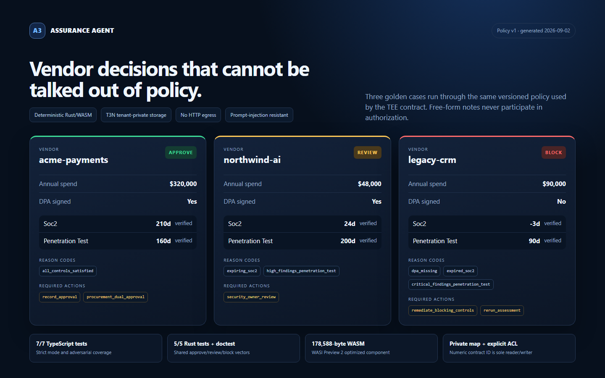

# Assurance Agent for Terminal 3

[](https://github.com/anghelocc23/t3n-assurance-agent/actions/workflows/ci.yml)

Assurance Agent turns vendor-security evidence into a deterministic procurement decision inside a Terminal 3 trusted execution environment (TEE). It is deliberately small, reproducible, and maintainable: policy is code, free-form notes cannot override controls, raw reports never enter the public output, and the latest decision is kept in a tenant-private T3N map.

## Why an enterprise would use it

Third-party security reviews are often a spreadsheet plus a long email thread. The result is slow, inconsistent, and hard to audit. This agent gives security and procurement teams a stable gate:

1. Normalize evidence metadata (verification status, expiry, open findings).
2. Apply versioned controls without an LLM in the decision path.
3. Return `approve`, `review`, or `block` with machine-readable reason codes.
4. Require dual procurement approval for high-spend vendors.
5. Store the decision in a private tenant map, scoped to the TEE contract.

The `untrusted_notes` field is accepted for workflow context but excluded from policy. That makes prompt-like text inert instead of letting a document tell the agent to bypass a control.

## Architecture

```text
vendor evidence system
        |
        | normalized metadata only
        v
TypeScript adapter ---- local deterministic tests
        |
        | assess-vendor(JSON)
        v
T3N agent session -> z:<tenant>:vendor-assurance (Rust/WASM in TEE)
                                      |
                                      v
                       z:<tenant>:assurance-decisions
                       private, contract-scoped KV map
```

The WIT world imports only `tenant-context`, `logging`, and `kv-store`. There is no outbound HTTP capability, so the deployed contract cannot exfiltrate evidence.

## Executable decision evidence



The dashboard is generated from the same scenarios exercised by the policy tests; it is not a hand-written mockup.

| Scenario | Evidence signal | Decision | Stable reason code |
| --- | --- | --- | --- |
| Verified, current evidence | No critical/high findings; DPA and dual approval present | `approve` | `all-controls-satisfied` |
| High-spend vendor missing second approver | Valid evidence, incomplete procurement control | `review` | `dual-approval-required` |
| Critical finding remains open | Verified report with unresolved critical exposure | `block` | `critical-findings-open` |

## Verify locally

Requirements: Node.js 20+.

```bash
npm install
npm run verify
```

This performs strict TypeScript checking, seven policy tests, and a three-scenario demo. The demo covers approve, review, and block paths. Shared golden vectors are evaluated by both the TypeScript adapter and the Rust contract to prevent policy drift.

Generate the screenshot-ready decision dashboard from those same executable scenarios:

```bash
npm run evidence
```

## Build the TEE contract

Requirements: Rust plus the WASI Preview 2 target.

```bash
rustup target add wasm32-wasip2
cd contract
cargo test
cargo build --target wasm32-wasip2 --release
```

The deployable component is written to `contract/target/wasm32-wasip2/release/z_vendor_assurance.wasm`.

## Connect and deploy to T3N testnet

The project reads the one-time sandbox credential only from the process environment. It never writes keys to disk or logs them.

```bash
export T3N_API_KEY="0x..."
export T3N_ENV="testnet"
npm run t3n:smoke
npm run t3n:deploy
```

`t3n:deploy` registers version `0.1.0`, publishes a function descriptor, creates the private `assurance-decisions` map with explicit reader/writer ACLs, and executes one assessment.

## Project map

- `src/policy.ts` — deterministic local policy adapter and input validation.
- `tests/policy.test.ts` — executable control and adversarial tests.
- `fixtures/golden-cases.json` — cross-language expected decisions.
- `contract/src/policy.rs` — the same policy in the TEE component.
- `contract/src/lib.rs` — WIT exports plus private T3N persistence.
- `src/t3n/` — attested connection, smoke check, and deployment.
- `docs/ARCHITECTURE.md` — security and maintenance choices.
- `docs/SUBMISSION.md` — concise bounty submission text and evidence checklist.
- `docs/BUGS.md` — reproducible current SDK/documentation mismatch and safe fix.
- `docs/PUBLIC_GOOGLE_DOC.md` — finished public-document copy with explicit live-evidence placeholders.
- `evidence/assurance-agent-demo.html` — visual dashboard generated from real policy decisions.
- `evidence/assurance-agent-demo.png` — ready-to-attach 1440 × 900 evidence screenshot.

## Security properties

- Testnet-only guard in the connection helper.
- Official signed trust manifest is fetched before handshake; no unsafe trust bypass.
- No API keys, PII, or raw vendor reports in source or logs.
- No HTTP host capability in WIT, which removes network egress from the contract.
- Fixed policy version and reason codes for auditability.
- Strict input limits, duplicate rejection, and inert untrusted notes.
- Private map with explicit reader and writer ACLs.
- CI verifies Node policy, Rust policy, and the WASI Preview 2 release build.

## Handover

I am happy to continue maintaining and running the agent after the challenge. The policy is isolated from T3N transport, so a new control or evidence type is a small reviewed change with matching TypeScript and Rust tests.
